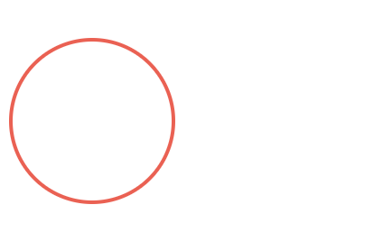
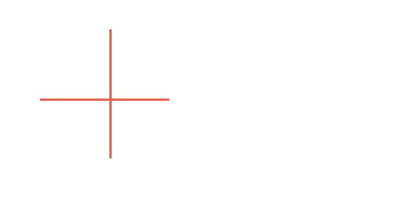
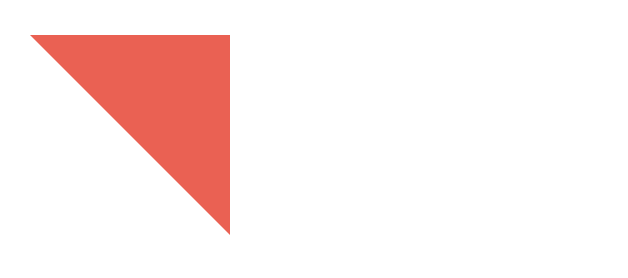
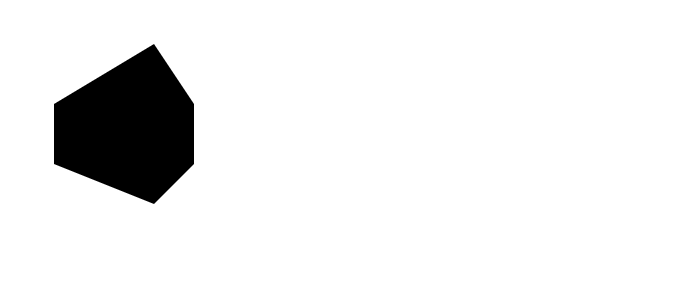
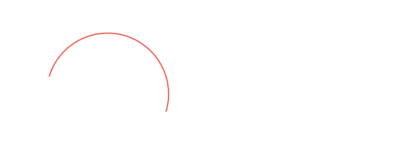
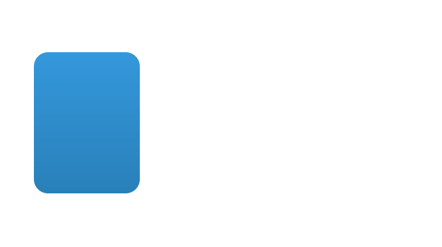
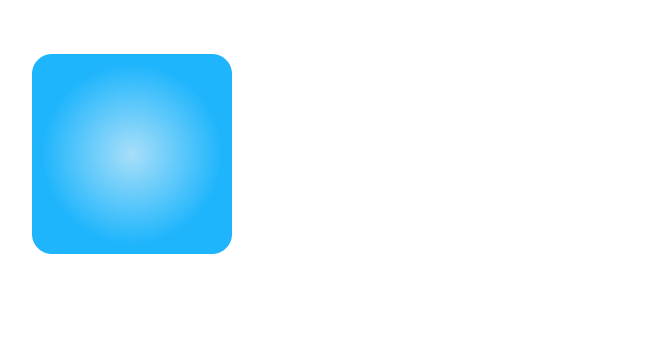
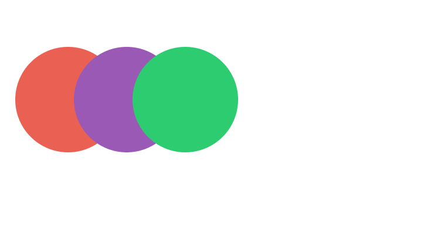
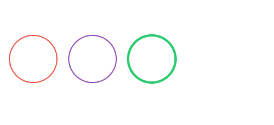

# weex-plugin-svg


a weex plugin to support svg for Web/iOS/Andoid


### Preview demo

``` bash
// if you didn't install weex-toolkit
npm install weex-toolkit@beta -g 

git clone https://github.com/weex-plugins/weex-plugin-svg.git

cd weex-plugin-svg

weex demos --entry demo/index.vue
```
[Demos](https://weex-plugins.github.io/weex-svg/weex.html?page=index.js)

### How to use

``` bash
<template>
  <div class="page">
    <svg style="width:300px;height:300px;">
      <rect x="20" y="20" rx="22.5" ry="22.5" width="100" height="45" fill="#ea6153"/> 
    </svg>
  </div>
</template

<style>
  .page{
    flex: 1;
  }
</style>

```

### SVG elements

#### rect

The rect element is an SVG basic shape, used to create rectangles based on the position of a corner and their width and height.

``` html
<svg style="width:300px;height:300px;">
  <rect x="20" y="20" width="160" height="160" fill="#f39c12"/> 
</svg>

```


#### circle

The `circle` element is an SVG basic shape, used to create circles based on a center point and a radius.

``` html
<svg style="width:300px;height:300px;">
  <circle cx="150" cy="50" r="45" fill="none" stroke-width="2" stroke="#ea6153"/>
</svg>
```



#### line

The `line` element is an SVG basic shape used to create a line connecting two points.

``` html
<svg style="width:300px;height:300px;">
  <line x1="10" y1="70" x2="120" y2="70" stroke="#ea6153" stroke-width="2" />
  <line x1="70" y1="10" x2="70" y2="120" stroke="#ea6153" stroke-width="2" />
</svg>
```



#### polyline

The `polyline` element is an SVG basic shape that creates straight lines connecting several points.

``` html
<svg style="width:300px;height:300px;">
  <polyline points="0,0 100,0 100,100" fill="#ea6153"></polyline>            
</svg>
```



#### polygon

The `polygon` element defines a closed shape consisting of a set of connected straight line segments.

``` html  
<svg style="width:300px;height:300px;">
  <polygon  points="0,30 50,0 70,30 70,60 50,80 0,60" />           
</svg>
```




#### path

The `path` element is the generic element to define a shape. All the basic shapes can be created with a path element.

``` html  
<svg style="width:300px;height:300px;">
  <path d="M50,50 A50,50 0 0,1 150,80" stroke="#e84c3d" fill="none" />           
</svg>
```



#### linear gradient

The `linearGradient` element lets users define linear gradients to fill or stroke graphical elements.

``` html  
<svg style="width:300px;height:300px;">
  <defs>
    <linearGradient id="myLinearGradient1"
                    x1="0%" y1="0%"
                    x2="0%" y2="100%"
                    spreadMethod="pad">
      <stop offset="0%"   stop-color="#3498db"/>
      <stop offset="100%" stop-color="#2980b9"/>
    </linearGradient>
  </defs>

  <rect x="10" y="10" width="75" height="100" rx="10" ry="10"
     style="fill:url(#myLinearGradient1);" />          
</svg>

```



#### radial gradient

``` html  
<svg style="width:300px;height:300px;">
  <defs>
    <radialGradient id="myRadialGradient4"
       fx="50%" fy="50%" r="45%"
       spreadMethod="pad">
      <stop offset="0%"   stop-color="#a8dff9" stop-opacity="1"/>
      <stop offset="100%" stop-color="#1fb5fc" stop-opacity="1" />
    </radialGradient>
  </defs>
  <rect x="20" y="10" width="100" height="100" rx="10" ry="10" fill="url(#myRadialGradient4)" />         
</svg>
```



### SVG  props

| props  | exmaple | Description  |
| ------ |:---------|:-------------|
| fill  | #1ba1e2 | For shapes and text, the fill attribute is a presentation attribute that define the color of the interior of the given graphical element |
| stroke  | green | The stroke attribute defines the color of the outline on a given graphical element. The default value for the stroke attribute is none |
| strokeWidth  | 2 | The strokeWidth attribute specifies the width of the outline on the current object|
| x  | 20 | Translate distance on x-axis.|
| y  | 20 | Translate distance on y-axis|

#### fill 

``` bash 
<svg style="width:300px;height:300px;">
  <circle cx="50" cy="50" r="45" style="fill:#ea6153;"/>
  <circle cx="100" cy="50" r="45" style="fill:#9b59b6;"/> 
  <circle cx="150" cy="50" r="45" style="fill:#2ecc71;"/>  
</svg>
```



#### stroke

``` bash
<svg style="width:300px;height:300px;">
  <circle cx="50" cy="50" r="20" fill="none" stroke="#ea6153"/>
  <circle cx="100" cy="50" r="20" fill="none" stroke="#9b59b6"/> 
  <circle cx="150" cy="50" r="20" fill="none" stroke="#2ecc71" stroke-width="2"/>  
</svg>
```




If you want to learn more about SVG , we suggest you read [SVG Tutorial-Jakob Jenkov](http://tutorials.jenkov.com/svg/index.html) .

